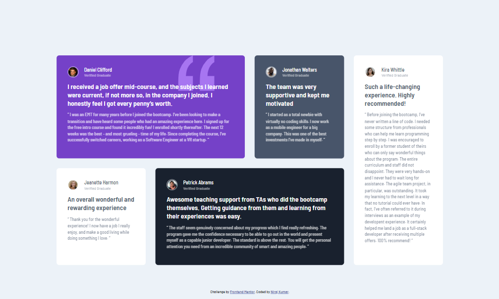
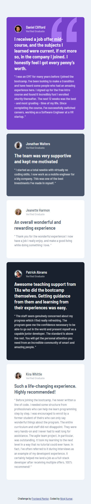

# Frontend Mentor - Testimonials grid section solution

This is a solution to the [Testimonials grid section challenge on Frontend Mentor](https://www.frontendmentor.io/challenges/testimonials-grid-section-Nnw6J7Un7). Frontend Mentor challenges help you improve your coding skills by building realistic projects. 

## Table of contents

- [Overview](#overview)
  - [The challenge](#the-challenge)
  - [Screenshot](#screenshot)
  - [Links](#links)
- [My process](#my-process)
  - [Built with](#built-with)
  - [What I learned](#what-i-learned)
- [Author](#author)

## Overview

### The challenge

Users should be able to:

- View the optimal layout for the site depending on their device's screen size

### Screenshot






### Links

- Solution URL: [Add solution URL here](https://your-solution-url.com)
- Live Site URL: [My Live Site](https://niraj-testimonials-grid.netlify.app/)

## My process

### Built with

- Semantic HTML5 markup
- CSS custom properties
- Flexbox
- CSS Grid
- Mobile-first workflow


### What I learned

- I gained a much better understanding of the basics of grid, and practically used it to build a responsive section.

- I also learnt that as of now it is not possible to take a color in a custom property and then later use it with an alpha channel applied to it. Although we can use something like what has been done below, the custom property itself isn't recognised as a color, and so it won't bring up the extremely handy color picker in VS code.

[See this for more info](https://stackoverflow.com/questions/40010597/how-do-i-apply-opacity-to-a-css-color-variable)

```css

body {
  --main-color: rgb(170, 68, 204);
  --main-color-rgb: 170,68,204;
  --main-color-r: 170;
  --main-color-g: 68;
  --main-color-b: 204;
}

.button-test {
  // Generated from the alpha function
  color: rgba(var(--main-color-r), var(--main-color-g), var(--main-color-b), 0.5);
  // OR (you wrote this yourself, see usage)
  color: rgba(var(--main-color-rgb), 0.5);
}
```

## Author

<!-- - Website - [Add your name here](https://www.your-site.com) -->
- Frontend Mentor - [@niraj-kumar-r](https://www.frontendmentor.io/profile/niraj-kumar-r)
- Twitter - [@niraj_kumar_r](https://www.twitter.com/niraj_kumar_r)